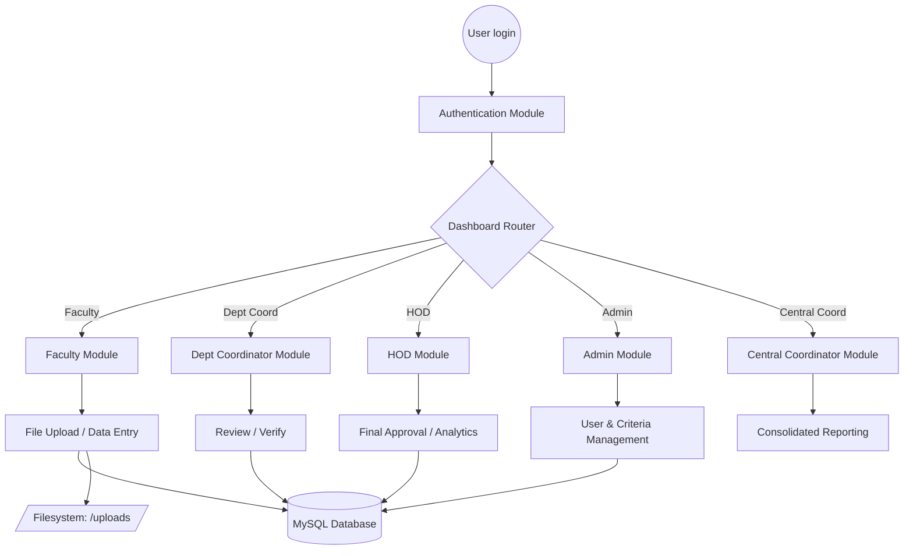
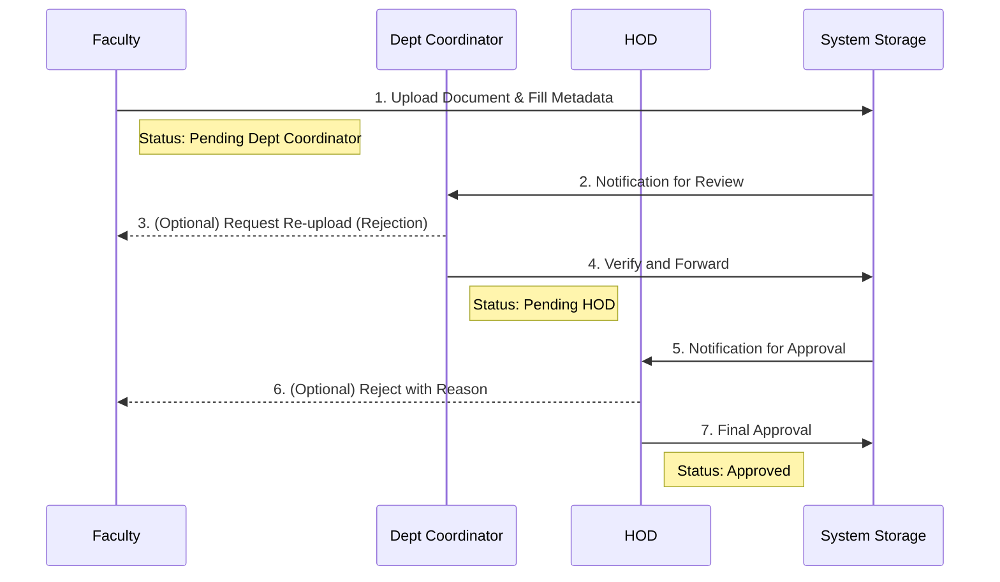

# Project Methodology and Flow Diagram

This document outlines the operational methodology, architectural design, and system flow of the **Faculty Management System (FMS)**.

---

## 1. Project Methodology

The **Faculty Management System (FMS)** is built using a **Modular Development Methodology** with a focus on **Role-Based Access Control (RBAC)** and a structured document lifecycle.

### 1.1 Development Approach
*   **Modular Architecture:** The system is divided into independent modules for different user roles (Faculty, Dept Coordinator, HOD, Admin, Central Coordinator) to ensure scalability and ease of maintenance.
*   **User-Centric Design:** Workflows are designed to mirror the actual administrative processes of an educational institution, moving from individual faculty contributions to institutional-level oversight.
*   **Data Integrity:** A multi-tier verification process ensures that all uploaded documents are reviewed and approved before becoming part of official records.
*   **Security-First:** Secure session management and department-level data isolation are used to reduce unauthorized access risk.

### 1.2 Core Components & Logic
1.  **Centralized Data Repository:** All academic and administrative files are stored in a structured directory (`uploads/`) with metadata indexed in a MySQL database.
2.  **Automated Approval Workflow:** A streamlined process for document submission, review, and final approval (Pending -> Approved/Rejected).
3.  **Criteria Mapping:** Documents are categorized according to accreditation standards (e.g., NAAC/NBA criteria), facilitating effortless compliance reporting.

---

## 2. System Architecture

The following diagram illustrates the high-level architecture of the FMS, showing how different layers interact.

---

## 3. Detailed Workflow: File Submission and Approval Lifecycle

This diagram depicts the journey of a document from the initial upload by a faculty member to its final approved state.

---

## 4. Technology Stack

*   **Frontend:** HTML5, CSS3, JavaScript (Bootstrap, FontAwesome)
*   **Backend:** PHP (Vanilla Core logic for performance and reliability)
*   **Database:** MySQL / MariaDB (Relational structure for accreditation criteria)
*   **Server Environment:** Apache/XAMPP for development and production hosting

---

## 5. Summary of Methodology
By automating the transition from paper-based files to a centralized digital platform, the FMS project methodology reduces administrative overhead, ensures 100% audit readiness for criteria-based inspections (like NAAC/NBA), and provides institutional leadership with real-time analytics to drive strategic decisions.
