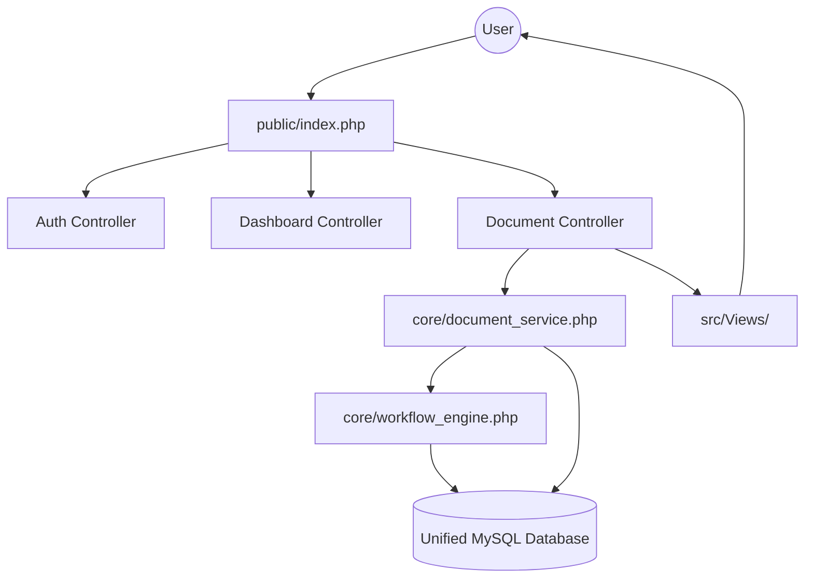
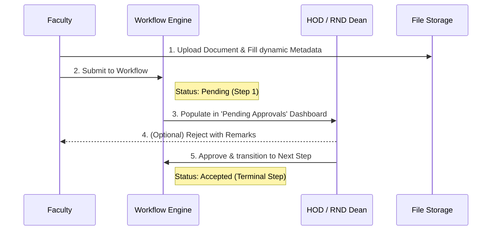

# Faculty Management System (FMS) 🚀

A premium, role-based document management solution designed for **GMRIT** and higher education institutions. FMS streamlines the lifecycle of academic and administrative proofs — from faculty uploads to workflow-driven approvals and accreditation-ready consolidation (NAAC/NBA).

---

## 🌟 What It Does

- **Faculty** upload proofs (publications, FDPs, conferences, patents, student activities, etc.) and track their real-time workflow status.
- **Reviewers (HOD, Dept Coordinator, RND Dean)** review items pending their approval, provide feedback, and accept or reject submissions directly from their dashboards.
- **Central Coordinator** flows (NAAC, NBA, NCC, Sports, Clubs, etc.) are managed through category-specific document filters.
- **Unified Modern Dashboard** intelligently routes users by role, providing quick-action cards, dynamic breadcrumbs, and consolidated document lists securely fenced by department and workflow state.

---

## 🛠️ Technology Stack

| Layer | Technologies |
| :--- | :--- |
| **Backend** | PHP 8.x (MVC-inspired architecture, `mysqli` with prepared statements) |
| **Database** | MySQL / MariaDB (`gmritfms` schema) |
| **Frontend** | Vanilla JS, CSS3, Modern UI/UX (Glassmorphism, Gradients), Google Fonts (Inter) |
| **Libraries** | `pdf-lib` (client-side PDF merge), `PHPMailer` (email notifications) |
| **Deployment** | Apache (XAMPP) / any PHP-capable host |

---

## 🔄 System Architecture & Workflow

### 🚀 The "FMS 2.0" Huge Shift
FMS recently underwent a massive architectural overhaul, migrating from a legacy procedural structure (where every document type had its own hardcoded PHP files and database tables) to a highly scalable, dynamic **MVC-inspired architecture**:
- **Unified Database:** Dozens of fragmented legacy tables (`published_tab`, `conference_tab`, `files`, etc.) were consolidated into a single powerful `documents` table, driven by a `document_types` metadata table.
- **Dynamic Workflow Engine:** Hardcoded statuses (`Pending HOD`, `Pending Dept Coordinator`) were replaced by a robust database-driven Workflow Engine (`workflow_steps`, `workflow_transitions`) capable of handling complex multi-step approval chains for any document type.
- **Centralized Routing:** The sprawling legacy directory structure (`modules/`, `HOD/`, `admin/`) was replaced by a sleek central router (`public/index.php`) and standard Controllers.

### Architecture Overview


### Dynamic File Submission Lifecycle


---

## 📂 Project Structure

```text
FMS/
├── public/
│   └── index.php             # Central Entry Point & Router
├── core/
│   ├── bootstrap.php         # Environment & Session Initialization
│   ├── config.php            # DB Credentials & Base URL Constants
│   ├── document_service.php  # Unified Document CRUD & Metadata handling
│   ├── workflow_engine.php   # Dynamic Workflow & State Machine logic
│   ├── file_service.php      # File upload validation and storage logic
│   └── constants.php         # RBAC Role Definitions
│
├── src/
│   ├── Controllers/          # Business Logic
│   │   ├── AuthController.php
│   │   ├── DashboardController.php
│   │   └── DocumentController.php
│   │
│   └── Views/                # Modern UI Templates
│       ├── auth/             # Login / Role Selection
│       ├── documents/        # Unified List, Upload, and View templates
│       └── dashboard.php     # Dynamic Role-Based Dashboard
│
├── includes/                 # Legacy Helpers (Email, PDF Merger)
├── database/                 # Schema Definitions & Master SQL
└── uploads/                  # User-uploaded files (organized by doc_id)
```

---

## 💾 Database Schema

**Database name:** `gmritfms`

### Unified Architecture Tables

| Category | Tables | Description |
| :--- | :--- | :--- |
| **RBAC** | `users`, `roles`, `user_roles`, `departments` | Unified authentication and role mappings. |
| **Documents (Core)** | `documents`, `document_files` | Single source of truth for all system files. |
| **Metadata Config** | `document_types`, `document_meta_fields` | Defines what fields belong to what document types. |
| **Metadata Storage** | `meta_research`, `meta_dept_files`, etc. | Stores the actual dynamic form data entered by users. |
| **Workflow Engine** | `workflows`, `workflow_steps`, `workflow_transitions`, `workflow_actions` | Powers the dynamic multi-step approval system. |
| **Audit** | `document_history` | Tracks every approval, rejection, and comment. |

> Note: Legacy tables (e.g., `published_tab`, `conference_tab`, `files5_1_1`) have been deprecated in favor of the new Unified Documents architecture.

---

## 🔐 Roles & Access Control

FMS uses a **Role-Based Access Control (RBAC)** system with 8 core roles:

| Role ID | Role | Key Capabilities |
| :---: | :--- | :--- |
| 1 | Admin | Full system access, document management |
| 2 | IQAC / Criteria Coordinator | Criteria-level monitoring |
| 3 | HOD | Departmental final approvals, analytics |
| 4 | Faculty | Upload proofs, track workflow status |
| 5 | Department Coordinator | Initial review, forward to HOD |
| 6 | Central Coordinator | Central event management |
| 7 | Junior Assistant | Academic year data entry |
| 8 | RND Dean | Research document oversight (FDP, Journals, Patents) |

- **Multi-Role Support:** Users can hold multiple roles. The dashboard auto-redirects single-role users and provides a sleek role-switcher for multi-role users.
- **Smart Fencing:** Document lists and dropdown filters are dynamically scoped. For example, the `RND Dean` automatically has their dashboard and lists filtered to only show `Research` documents, while `HODs` are securely fenced to their specific `Department`.

---

## 🚀 Installation

### Prerequisites
- PHP 8.x
- MySQL / MariaDB
- Apache with `mod_rewrite` (XAMPP recommended for local dev)

### Quick Setup

1. **Clone & Place** the project in your web server root:
   ```bash
   git clone https://github.com/Karanam-Gowtham/FMS.git
   # Place in htdocs/mini/FMS (for XAMPP)
   ```

2. **Database**:
   ```sql
   CREATE DATABASE gmritfms;
   ```
   Import the schema via phpMyAdmin or CLI:
   ```bash
   mysql -u root gmritfms < database/master.sql
   ```

3. **Configuration**:
   Copy `.env.example` to `.env` (or edit `core/config.php`):
   - Update `BASE_URL` to match your environment (default: `http://localhost/mini/FMS/`)
   - Configure your DB credentials (`DB_HOST`, `DB_USER`, `DB_PASS`, `DB_NAME`).

4. **Access**: Navigate to `http://localhost/mini/FMS/public/index.php`.

---

## 🔒 Security

- **Centralized Routing:** All traffic passes through `public/index.php`, preventing direct access to secure backend scripts.
- **Workflow Security:** Action buttons (`Approve`, `Reject`) only render if the Workflow Engine explicitly grants permission based on the document's current step, the user's role, and their department.
- **File Path Gating:** File viewing resolves paths against the database — completely eliminating arbitrary URL directory traversal.
- **SQL Injection Prevention:** Prepared statements (`mysqli`) are strictly enforced for all CRUD operations.

---

## 📝 Recent "FMS 2.0" Changes

- **Massive UI Overhaul**: Replaced the outdated HTML interfaces with a stunning, premium frontend featuring modern gradients, hover states, and dynamic Glassmorphism.
- **Unified Document Service**: Consolidated 20+ legacy tables into a single `documents` architecture with dynamic metadata.
- **Dynamic Workflow Engine**: Implemented a state machine that handles multi-tier approvals (`Pending -> Dept Coord -> HOD -> Accepted`) without hardcoded logic.
- **Role-Based Smart Filtering**: Dashboards now intelligently strip away irrelevant UI clutter. Reviewers only see documents assigned to them, and filters automatically adapt to the user's domain (e.g., Central Roles get Department filters, RND gets Research filters).
- **Codebase Cleanup**: Removed dozens of deprecated legacy pages and migrated logic to the new `src/Controllers` ecosystem.

---

## ⚖️ License

This project is developed for institutional use at GMRIT. See [LICENSE](LICENSE) for details.
