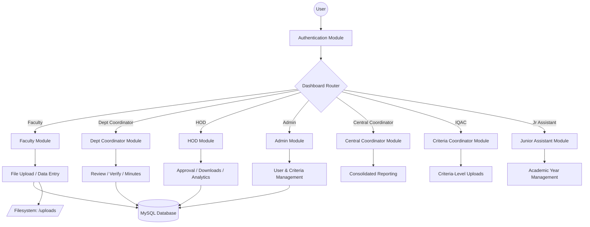
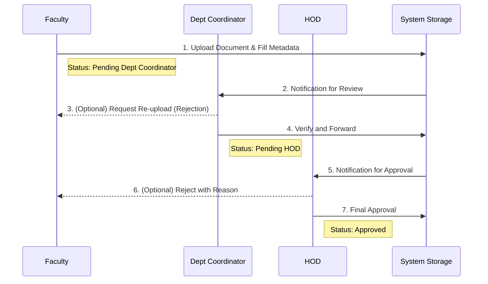

# Faculty Management System (FMS) 🚀

A premium, role-based document management solution designed for **GMRIT** and higher education institutions. FMS streamlines the lifecycle of academic and administrative proofs — from faculty uploads to HOD approval and accreditation-ready consolidation (NAAC/NBA).

---

## 🌟 What It Does

- **Faculty** upload proofs (publications, FDPs, conferences, patents, student activities, placement/higher-education files, etc.) and track approval status.
- **Head of Department (HOD)** reviews items (`Pending HOD`), approves/rejects, and downloads consolidated department reports.
- **Department Coordinator** handles `Pending Dept Coordinator` workflow, meeting minutes (AMC, BOS), and departmental file management.
- **Central Coordinator** flows (NAAC, NBA, NCC, Sports, Clubs, etc.) operate via `modules/central/` with event-based navigation.
- **Criteria Coordinator (IQAC)** manages criteria-level uploads and AQAR consolidation.
- **Junior Assistant** manages academic year entry workflows.
- **Admin** area under `admin/` handles criteria uploads, bulk download/delete, and department entry.
- **Unified Dashboard** (`dashboard.php`) routes users by role with auto-detection for single-role accounts; the header polls `check_notifications.php` every 60s for a pending-work badge count.

---

## 🛠️ Technology Stack

| Layer | Technologies |
| :--- | :--- |
| **Backend** | PHP 8.x (procedural, `mysqli` with prepared statements) |
| **Database** | MySQL / MariaDB (`gmritfms` schema) |
| **Frontend** | Vanilla JS, CSS3, Google Fonts (Inter/Roboto), Bootstrap icons, FontAwesome |
| **Libraries** | `pdf-lib` (client-side PDF merge), `PHPMailer` (email notifications) |
| **Deployment** | Apache (XAMPP) / any PHP-capable host |

---

## 🔄 System Architecture & Workflow

### Architecture Overview


### File Submission & Approval Lifecycle


---

## 📂 Project Structure

```text
FMS/
├── index.php                 # Landing page (hero + sign-in/register)
├── config.php                # Centralized path & DB constants (env-aware)
├── dashboard.php             # Role-aware dashboard router (auto-redirects single-role users)
├── check_notifications.php   # AJAX endpoint — returns pending count as JSON
├── pdf_merger.php            # PDF Merger tool page (client-side pdf-lib)
├── .htaccess                 # Apache rewrite rules
│
├── includes/
│   ├── connection.php        # DB connection + session bootstrap (reads config.php constants)
│   ├── session.php           # Secure cookie parameters (HttpOnly, SameSite, HTTPS-aware)
│   ├── header.php            # Shared navigation bar, breadcrumbs, notification badge, modal dashboard
│   ├── helpers.php           # RBAC helpers: role constants, login checks, role switching, pending counts
│   ├── breadcrumb.php        # Dynamic breadcrumb generator (context-aware)
│   ├── constants.php         # Criteria labels, table names, status strings, shared defines
│   ├── dept_scope.php        # Table→owner column mapping, dept/faculty SQL fragments, file-path gating
│   ├── dashboard_table.php   # Dashboard table rendering component
│   ├── csrf.php              # CSRF token helpers
│   ├── process_approval.php  # POST handler for approve/reject actions
│   ├── send_email.php        # PHPMailer wrapper
│   ├── PDFMerger.php         # Server-side PDF merge library
│   └── PHPMailer/            # PHPMailer library
│
├── modules/
│   ├── auth/                 # login.php, logout.php, reg.php (unified RBAC login)
│   ├── faculty/              # Faculty workflows: academic year, criteria uploads, profiles,
│   │   │                     #   publications, FDPs, conferences, patents, student activities
│   │   ├── templates_docs/   # Document templates for faculty
│   │   └── uploads/          # Faculty-specific uploads
│   ├── dept_coordinator/     # DC workflows: file review, meeting minutes (AMC/BOS), downloads
│   │   └── uploads/          # DC-specific uploads
│   ├── central/              # Central coordinator: AQAR files, events, criteria-level uploads
│   ├── jr_assistant/         # Junior assistant: academic year management
│   └── common/               # Shared: PDF merger page, file viewer, merged PDF save handler
│
├── HOD/                      # HOD pages: faculty file review, downloads (per-category),
│   │                         #   academic year tools, criteria management, meeting minutes
│   ├── img/                  # HOD-specific images
│   └── js/                   # HOD-specific scripts
│
├── admin/                    # Admin panel: user management, criteria uploads,
│   │                         #   bulk download/delete, department entry
│   ├── img/                  # Admin-specific images
│   ├── js/                   # Admin-specific scripts
│   └── uploads1/             # Admin-specific uploads
│
├── public/                   # Public-facing pages (dept info, public file viewer)
│
├── assets/
│   ├── css/                  # 27 stylesheets (page-specific CSS)
│   ├── js/                   # main.js (shared client-side logic)
│   ├── img/                  # Logos and landing page images
│   └── templates/            # Document templates (FDP photos, conference photos)
│
├── database/
│   └── master.sql            # Full schema dump (gmritfms database — import for fresh install)
│
├── uploads/                  # User-uploaded files (organized by category subdirectories)
│   ├── certificates/
│   ├── conference/
│   ├── fdps/
│   ├── fdps_org/
│   ├── patents/
│   ├── profiles/
│   ├── published/
│   └── student_act/
│
└── prepare/                  # Project documentation (problem statement, architecture,
                              #   workflow, tech stack, contributions, challenges, testing)
```

---

## 💾 Database Schema

**Database name:** `gmritfms`

### Setup

1. Create database `gmritfms` in phpMyAdmin (or CLI).
2. Import `database/master.sql`.
3. Credentials are configured via `config.php` which reads environment variables (`DB_HOST`, `DB_USER`, `DB_PASS`, `DB_NAME`) with fallbacks to `localhost` / `root` / empty / `gmritfms`.

### Key Tables

| Category | Tables |
| :--- | :--- |
| **RBAC** | `Users`, `Roles`, `User_Roles`, `Dept` |
| **Academic** | `academic_year`, `criteria`, `criteria1`, `criteria2`, `nba_criteria`, `nba_criteria1`, `nba_criteria2` |
| **Faculty Uploads** | `files`, `files5_1_1and2`, `files5_1_3`, `files5_1_4`, `files5_2_1`, `files5_2_2`, `files5_2_3`, `files5_3_1`, `files5_3_3` |
| **Achievements** | `published_tab`, `conference_tab`, `conf_org_tab`, `fdps_tab`, `fdps_org_tab`, `patents_table` |
| **Student Activities** | `s_journal_tab`, `s_conference_tab`, `s_events`, `s_bodies` |
| **Department** | `dept_files`, `dc_up_files` |
| **Central/Admin** | `a_files`, `a_c_files`, `a_cri_files`, `central_files` |
| **Workflow** | `rejection_history`, `Document_Types`, `Documents`, `Document_Actions`, `Approval_Flow` |
| **Legacy Auth** | `reg_tab`, `login_pg`, `reg_hod`, `reg_dept_cord`, `reg_central_cord`, `reg_cri_cord`, `reg_jr_assistant` |

### Notable Concepts

- Every file table has a **`status`** column (`Pending Dept Coordinator` → `Pending HOD` → `Accepted` / `Rejected`) and optional **`rejection_reason`**.
- **`rejection_history`** stores audit rows for dashboard tracking.
- **`academic_year`** drives year pickers across all modules.

---

## 🔐 Roles & Access Control

FMS uses a **Role-Based Access Control (RBAC)** system with 7 roles:

| Role ID | Role | Landing Page | Key Capabilities |
| :---: | :--- | :--- | :--- |
| 1 | Admin | `HOD/acd_year_aa.php` | Full system access, criteria management |
| 2 | IQAC / Criteria Coordinator | `modules/central/c_aqar_files.php` | Criteria-level uploads, AQAR management |
| 3 | HOD | `HOD/hod_acd_year.php` | Approve/reject, department analytics, downloads |
| 4 | Faculty | `modules/faculty/acd_year.php` | Upload proofs, track status, edit profile |
| 5 | Department Coordinator | `modules/dept_coordinator/dc_acd_year.php` | Review uploads, meeting minutes, forward to HOD |
| 6 | Central Coordinator | `modules/central/c_aqar_files.php` | Central event management (NAAC, NBA, NCC, etc.) |
| 7 | Junior Assistant | `modules/jr_assistant/jr_acd_year.php` | Academic year data entry |

- Users can hold **multiple roles** — the dashboard auto-redirects single-role users and shows a role picker for multi-role users.
- `includes/helpers.php` manages role switching with `setActiveRoleContext()` which sets both modern session keys and legacy compatibility keys.
- `includes/dept_scope.php` gates file listings and views by **faculty ownership** and **department**, preventing cross-department access.

---

## 🚀 Installation

### Prerequisites
- PHP 8.x
- MySQL / MariaDB
- Apache with `mod_rewrite` (XAMPP recommended for local dev)

### Quick Setup

1. **Clone & Place** the project in your web server root:
   ```bash
   git clone https://github.com/Karanam-Gowtham/FMS.git
   # Place in htdocs/mini/FMS (for XAMPP)
   ```

2. **Database**:
   ```sql
   CREATE DATABASE gmritfms;
   ```
   Then import `database/master.sql` via phpMyAdmin or CLI:
   ```bash
   mysql -u root gmritfms < database/master.sql
   ```

3. **Configuration** — Edit `config.php`:
   - Update `BASE_URL` to match your environment (default: `http://localhost/mini/FMS/`)
   - DB credentials are read from environment variables (`DB_HOST`, `DB_USER`, `DB_PASS`, `DB_NAME`) with sensible defaults for local XAMPP.

4. **Access** — Navigate to `http://localhost/mini/FMS/` and register or log in.

---

## 🔒 Security

- **Session Security**: `HttpOnly`, `SameSite=Lax`, and HTTPS-aware `Secure` flags on session cookies (configured in `includes/session.php`).
- **CSRF Protection**: Token-based CSRF enforcement on POST flows (dashboard actions, admin forms, central login).
- **Department Scoping**: `dept_scope.php` prevents users from viewing or acting on files outside their department/ownership.
- **File Path Gating**: File view endpoints (`view_file.php`, `view_file_hod.php`, `view_file1.php`) resolve paths against the database — no arbitrary `uploads/` URL access.
- **SQL Injection Prevention**: Prepared statements (`mysqli`) used throughout.
- **Table Name Validation**: `process_approval.php` validates table names against a whitelist before executing updates.

> ⚠️ **Note**: Legacy auth tables store passwords as-is. Treat the database as sensitive and use HTTPS in production.

---

## 🛠️ Utilities

- **PDF Merger**: Client-side PDF merging via `pdf-lib` on `pdf_merger.php` and within download pages (`admin/download.php`, `HOD/hod_fac_download.php`). Merged PDFs are saved via `save_merged_pdf.php`.
- **Email Notifications**: `includes/send_email.php` wraps PHPMailer for approval/rejection email alerts.
- **Notification Polling**: `check_notifications.php` returns pending counts as JSON, polled every 60 seconds by the header badge.

---

## 📝 Recent Changes

- **Codebase Cleanup**: Removed 59 development/debug/migration scripts from the project root (test scripts, DB fix scripts, schema inspectors, dangerous utilities like `truncate.php` and `recreate_db.php`).
- **Centralized Configuration**: Introduced `config.php` with environment variable support for all paths and DB credentials (replaces scattered hardcoded values).
- **RBAC Architecture**: Migrated from legacy per-role registration tables to a unified `Users` + `Roles` + `User_Roles` system with backward-compatible session bridging.
- **Unified Login**: Single login page (`modules/auth/login.php`) with multi-role support and automatic role-based routing via `dashboard.php`.
- **Notification System**: Added real-time pending-work badge in the global header with 60-second polling.
- **Breadcrumb Navigation**: Dynamic, context-aware breadcrumbs integrated into the header for all module pages.
- **Department Scoping**: Added `dept_scope.php` for consistent department-based access control across all file tables.
- **Session Hardening**: Secure cookie parameters with HTTPS detection.
- **PHPMailer Integration**: Converted from git submodule to regular directory for simpler deployment.

---

## ⚖️ License

This project is developed for institutional use at GMRIT. See [LICENSE](LICENSE) for details.

When extending file tables, maintain `includes/dept_scope.php` integrity for security compliance. Update `BASE_URL` in `config.php` when deploying to a different base path.
