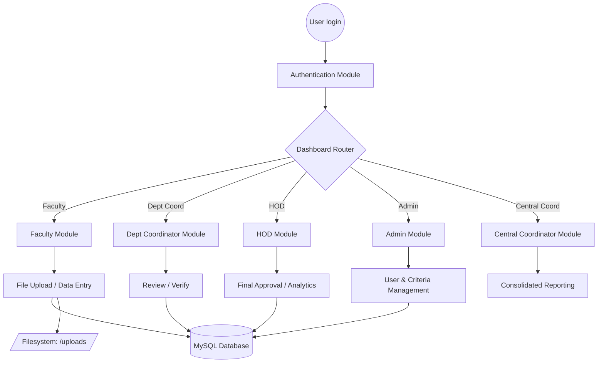
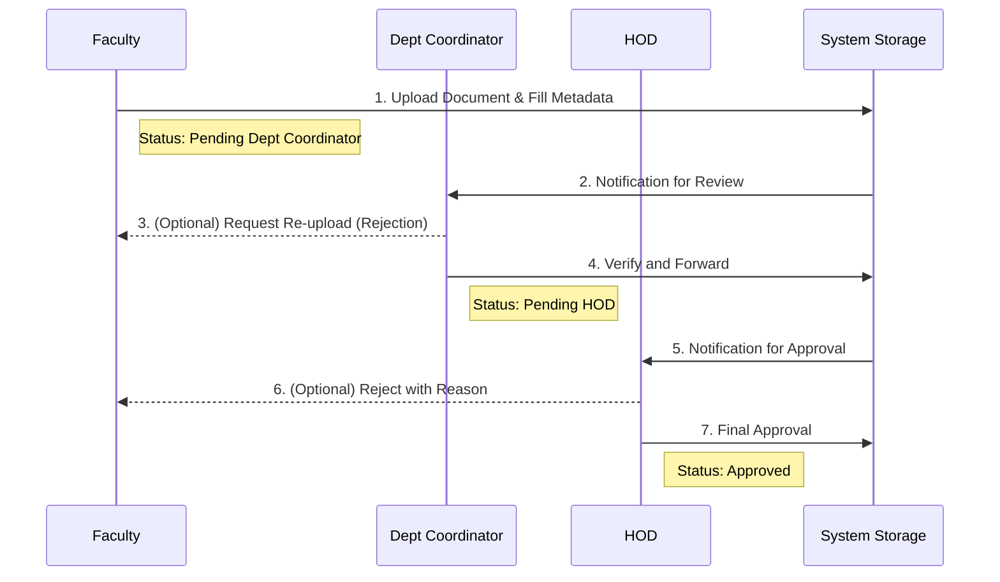

# Faculty Management System (FMS) 🚀

A premium, role-based document management solution designed for **GMRIT** and higher education institutions. FMS streamlines the lifecycle of academic and administrative proofs, from faculty uploads to HOD approval and accreditation-ready consolidation (NAAC/NBA).

---

## 🌟 What it does

- **Faculty** upload proofs (publications, FDPs, conferences, patents, student activities, placement/higher-education files, etc.) and track status.
- **Head of Department (HOD)** reviews items first (`Pending HOD`), then **Department Coordinator** or **Junior Assistant** (`Pending Dept Coordinator`).
- **Central flows** (NAAC, NBA, NCC, Sports, clubs, etc.) use `modules/central/` and `c_login_n.php` / `c_login.php` with event-based navigation.
- **Unified dashboard** (`dashboard.php`) lists pending work by role; the main header can open it in a modal iframe and polls `check_notifications.php` for a badge count.
- **Admin** area under `admin/` handles criteria uploads, bulk download/delete, and department entry via `admins.php`.
- **Access control helpers** in `includes/dept_scope.php` scope listings and file actions by **faculty ownership** or **uploader department** (`reg_tab.dept`), and gate **path-based file views** so users cannot open arbitrary `uploads/` URLs.

---

## 🛠️ Technology Stack

| Layer | Technologies |
| :--- | :--- |
| **Backend** | PHP 7.4+ / 8.x (Core logic for maximum performance) |
| **Database** | MySQL / MariaDB (Project-FMS Schema) |
| **Frontend** | Vanilla JS, CSS3, Google Fonts (Inter/Roboto), Bootstrap, FontAwesome |
| **Libraries** | `pdf-lib` (Client-side PDF processing), `mysqli` (Prepared statements) |
| **Deployment** | Apache (XAMPP) / Render / Railway / Linux VPS |

---

## 🔄 System Architecture & Workflow

### Architecture Overview


### File Submission & Approval Lifecycle


---

## 📂 Project Architecture

```text
FMS/
├── dashboard.php             # Centralized Task Management (Role-aware)
├── includes/
│   ├── connection.php        # DB + base_url + session bootstrap + CSRF token seed (Supports Render/Railway env variables)
│   ├── session.php           # Cookie parameters
│   ├── csrf.php              # CSRF helpers
│   ├── dept_scope.php        # Table→owner column, dept/faculty SQL fragments, row scope, file_path checks
│   ├── constants.php         # Criteria labels and shared defines
│   ├── header.php            # Shared navigation (Central / Department / Dashboard modal)
│   └── send_email.php        # Mail helper
├── modules/
│   ├── auth/                 # login.php, logout.php, reg.php
│   ├── faculty/              # Academic year, criteria uploads, profiles, FDPS, etc.
│   ├── dept_coordinator/     # DC workflows, minutes, downloads
│   ├── central/              # Central logins and file flows (AQAR, events, uploads)
│   ├── jr_assistant/         # Junior assistant entry (e.g. jr_acd_year.php)
│   └── common/               # pdf_merger.php, view_file1.php, save_merged_pdf.php
├── HOD/                      # HOD pages, downloads, academic year tools, view_file*.php
├── admin/                    # admins.php, criteria_*.php, upload*.php, download.php, etc.
├── database/
│   └── project-fms.sql       # Schema dump (import for fresh install)
├── assets/                   # CSS, JS, images
└── _deprecated/              # Old copies; do not use for production paths
```

*Note: The root also contains maintenance/debug scripts (`migrate_*.php`, `debug_*.php`, `verify_schema.php`, etc.) — use these only in development.*

---

## 💾 Database Schema Details

1. **Database Setup:**
   - Create database **`project-fms`** in phpMyAdmin (or CLI).
   - Import **`database/project-fms.sql`**.
   - Adjust credentials in **`includes/connection.php`** if not using `root` with an empty password or set the appropriate environment variables (`MYSQLHOST`, `MYSQLUSER`, `MYSQLPASSWORD`, `MYSQLDATABASE`, `MYSQLPORT`).

2. **Notable Concepts:**
   - Multiple **file tables** (`files`, `files5_*`, `fdps_tab`, `conference_tab`, `published_tab`, `patents_table`, `dept_files`, student activity tables, etc.) with **`status`** and **`rejection_reason`** where applicable.
   - **`rejection_history`** stores rejection audit rows (used from `dashboard.php`).
   - **`academic_year`** and related tables drive year pickers across modules.

---

## 🚀 Installation (Quick Setup)

1. **Clone & Drop**: Place the project in your web server root (e.g., `htdocs/mini/FMS` for XAMPP).
2. **Database Initialization**:
   - Create a database named `project-fms`.
   - Import `database/project-fms.sql` to seed the schema.
3. **Configuration**:
   - Edit `includes/connection.php`.
   - Update `$base_url` to match your local environment (e.g., `http://localhost/mini/FMS/`). If deploying on Railway or Render, `$base_url` is automatically determined from environment variables.
   - Configure your DB credentials (`$host`, `$user`, `$pass`, `$db`) or provide them via `.env`/environment variables.
4. **Access**: Navigate to the base URL and log in with your credentials.

---

## 🔒 Security Notes (Operator Awareness)

- **CSRF** is enforced on several POST flows (e.g. dashboard actions, some admin forms, central login form).
- **Dashboard** (`dashboard.php`) unions pending rows with **department-aware** filters for HOD / department coordinator / junior assistant (via `dept_scope.php`); approve/reject/re-upload checks the same row scope.
- **Bulk download / delete** on `admin/download.php` and **`HOD/hod_fac_download.php`** resolve the correct upload table per criteria, filter lists and Excel exports by role:
  - **Faculty** = own uploads
  - **HOD / DC / Jr** = uploaders in `reg_tab` for that department
  - **Admin & Central Coordinator** sessions = unfiltered on those pages
- **File viewing:** `admin/view_file.php` (with `file_path`), `HOD/view_file_hod.php`, `HOD/view_file.php` (faculty), and `modules/common/view_file1.php` resolve the path against the database and enforce the same ownership/dept rules (admin bypass where implemented). `a_files` lookups by `id` in `admin/view_file.php` are limited to the owning faculty unless `admin`.
- **Merged PDF POST target:** from `admin/download.php` use **`admin/save_merged_pdf.php`** (same directory). From **`HOD/hod_fac_download.php`** the client posts to **`../admin/save_merged_pdf.php`**.
- **Other download UIs** (`admin/download_cri.php`, `admin/download_cent.php`) use **`a_files` / `a_c_files`** — they are separate from the main `files` / `files5_*` flows; review those if you need the same dept/owner guarantees.
- Passwords are handled **as stored in the database** (plain text in typical legacy flows). Treat the DB as sensitive and restrict access; prefer HTTPS in production.

---

## 🛠️ Utilities

- **PDF merge:** `modules/common/pdf_merger.php` and merge actions in `admin/download.php` / `HOD/hod_fac_download.php` (browser-side PDF-lib + POST to `save_merged_pdf.php`).
- **Merged PDF upload handlers:** `admin/save_merged_pdf.php`, `modules/common/save_merged_pdf.php` (session-protected; call the handler that matches your page directory).

---

## 📝 Recent Version Notes

> [!NOTE]
> **Version Update (HEAD):** Currently at version `v1.0.0` (commit `317ef43`).

**Recent Updates:**
- Introduced support for cloud deployment (Render & Railway) with environment variable logic in `includes/connection.php`.
- Enhanced dashboard UI, improving stability and fully reverting to compatible architecture for the new seamless "View" buttons.
- Streamlined UI by removing redundant file show buttons and dead breadcrumbs.
- Refined project infrastructure and streamlined deployment flow by removing experimental Docker configuration files.

---

## ⚠️ Known Limitations & Pending Implementations

Following a complete codebase audit, the following features are documented but currently **partially implemented** or **missing**:

- **Faculty Placement & Higher Education Uploads**: While the dashboard accounts for placement records (`files5_2_1`), there is currently no dedicated UI button or module (`placement.php`) in the Faculty portal (`modules/faculty/acd_year.php`) for faculty to directly upload these files. They are currently routed through the Department Coordinator workflows.
- **Central Events Mismatch**: The global header (`includes/header.php`) provides links for **NAAC**, **NBA**, and **Clubs**. However, the central directory page (`modules/central/central_events.php`) is missing these options, leaving them partially orphaned.

---

## ⚖️ License

This project is developed for institutional use. Maintain the `includes/dept_scope.php` integrity when extending file tables to ensure security compliance. Update **`$base_url`** and any hardcoded paths (`/mini/FMS/` in `includes/header.php` iframe) when deploying to a different base path.
